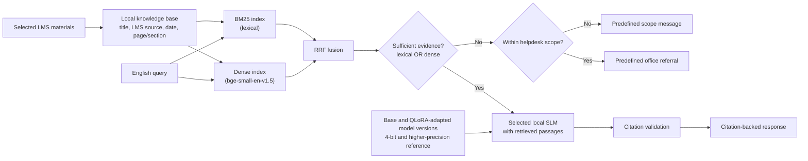

# Architecture and Design

## Purpose

This document specifies the controlled prototype described in the governing [Thesis Battle Plan](THESIS_BATTLE_PLAN.md). It is deliberately limited to English BM25 RAG on selected LMS materials.

## System boundary

- **Input corpus:** selected student-facing LMS handbooks, rules, policies, and related information materials.
- **Input query:** English university-related query.
- **Output:** citation-backed response, or a predefined non-answer/office referral.
- **Environment:** local test machine with an 8 GB VRAM GPU.
- **Excluded:** live LMS integration, personal records, reranking, multilingual support, and production operation.

## Architecture

## Knowledge base

Each indexed passage should retain:

- document title;
- LMS source or module location;
- available publication or revision date;
- page, section, or heading;
- stable local document and passage identifier.

The corpus should contain only materials appropriate for student-facing information. If a document is outdated, missing, or contradictory, record the issue and do not treat the answer as fully supported.

Source PDFs contain tables (fee schedules, grading scales, program-to-hours mappings, outline-style appendices) that must be extracted without inventing row correspondences that aren't in the source or losing indentation that expresses real nesting. [docs/TABLE_HANDLING_PLAN.md](docs/TABLE_HANDLING_PLAN.md) specifies the extraction rules and an ambiguous-case flag report (`data/sanitize/table_report.json`) for anything the extractor can't confidently classify.

## Retrieval and routing

Retrieval uses a hybrid approach combining lexical and semantic evidence:

- **BM25 (lexical):** exact term and form-code matching (e.g., "drop" → "Dropping of Courses"; `PNC:AA-FO-45` → exact document ID).
- **Dense embedding (semantic):** paraphrase and intent matching (e.g., "can I take a break" → "Leave of Absence"). Chunk embeddings are held in an in-memory array and searched exhaustively, which is exact and sub-millisecond at this corpus size; no vector database or approximate-nearest-neighbor index is used.
- **Rank fusion (RRF):** combines both rankings without score normalization.
- **Disjunctive sufficiency gate:** accepts evidence if either BM25 or dense retriever exceeds its component threshold, reducing the risk that vocabulary differences alone cause unnecessary referrals.

Routing is intentionally lightweight, and retrieval runs before the scope check:

1. Retrieve passages from both BM25 and dense retrieval, fuse rankings with RRF, and check sufficiency.
2. If relevant evidence is available, generate a concise answer using only that evidence and attach source citations.
3. If evidence is absent or insufficient, check scope: return the predefined scope message if the query is clearly outside helpdesk scope, otherwise return the office referral.

Retrieval runs first so that a query retrieval can already answer is never rejected as out of scope beforehand — the scope check only distinguishes between the two kinds of insufficient-evidence outcome, it never blocks retrieval itself.

The prototype does not promise a clarification route, confidence calibration, authentication, restricted-data handling, or reranking.

## Model and comparison design

The final model name is selected before implementation using documented feasibility criteria. It must support local inference within the test environment.

### Behavior comparison

| Configuration | Purpose |
| --- | --- |
| Base model, 4-bit, identical RAG | Baseline for QLoRA behavior comparison |
| QLoRA-adapted model, 4-bit, identical RAG | Measures behavior adaptation |

QLoRA training examples teach use of retrieved evidence, citation formatting, concise answers, and non-answer/referral behavior. Changeable university facts remain in the LMS corpus.

### Quantization comparison

| Configuration | Purpose |
| --- | --- |
| Base model, feasible higher-precision reference | Quality/performance reference |
| Base model, 4-bit | Measures memory and latency trade-off |

The higher-precision reference must run under comparable conditions. Do not compare 4-bit with a configuration that fails, offloads to different hardware, or changes the test conditions.

## Evaluation measures

- answer correctness;
- groundedness and citation accuracy;
- correct handling of unsupported or out-of-scope queries;
- end-to-end response latency;
- throughput;
- peak VRAM consumption;
- selected ISO-guided quality characteristics.

Use the same corpus, query set, prompt, decoding settings, and hardware for each controlled comparison. Retrieve once per query and replay identical cached evidence across model configurations so that differences are attributable to the varied factor alone.

[EVALUATION_PLAN.md](EVALUATION_PLAN.md) specifies the configurations, query-set composition, gold-chunk annotation protocol, and which measures are automatic versus human-scored.

