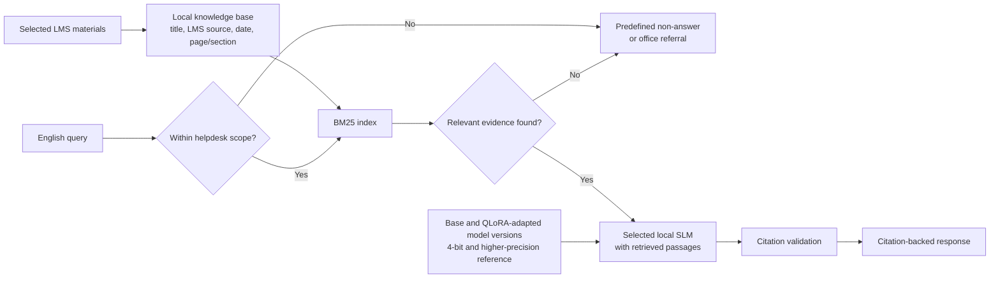

# Architecture and Design

## Purpose

This document specifies the controlled prototype described in the governing [Thesis Battle Plan](THESIS_BATTLE_PLAN.md). It is deliberately limited to English BM25 RAG on selected LMS materials.

## System boundary

- **Input corpus:** selected student-facing LMS handbooks, rules, policies, and related information materials.
- **Input query:** English university-related query.
- **Output:** citation-backed response, or a predefined non-answer/office referral.
- **Environment:** local test machine with an 8 GB VRAM GPU.
- **Excluded:** live LMS integration, personal records, dense retrieval, reranking, multilingual support, and production operation.

## Architecture

## Knowledge base

Each indexed passage should retain:

- document title;
- LMS source or module location;
- available publication or revision date;
- page, section, or heading;
- stable local document and passage identifier.

The corpus should contain only materials appropriate for student-facing information. If a document is outdated, missing, or contradictory, record the issue and do not treat the answer as fully supported.

## Retrieval and routing

BM25 is the sole retriever. It matches English query terms against the local corpus. Its limitation with synonyms and paraphrases is reported, not solved by adding unapproved dense-retrieval features.

Routing is intentionally lightweight:

1. If a query is clearly outside helpdesk scope, return the predefined scope message.
2. For an in-scope query, retrieve BM25 passages.
3. If relevant evidence is available, generate a concise answer using only that evidence and attach source citations.
4. If evidence is absent or insufficient, return a predefined non-answer or office referral.

The prototype does not promise a clarification route, confidence calibration, authentication, or restricted-data handling.

## Model and comparison design

The final model name is selected before implementation using documented feasibility criteria. It must support local inference within the test environment.

### Behavior comparison

| Configuration | Purpose |
| --- | --- |
| Base model, 4-bit, identical RAG | Baseline for QLoRA behavior comparison |
| QLoRA-adapted model, 4-bit, identical RAG | Measures behavior adaptation |

QLoRA training examples teach use of retrieved evidence, citation formatting, concise answers, and non-answer/referral behavior. Changeable university facts remain in the LMS corpus.

### Quantization comparison

| Configuration | Purpose |
| --- | --- |
| Base model, feasible higher-precision reference | Quality/performance reference |
| Base model, 4-bit | Measures memory and latency trade-off |

The higher-precision reference must run under comparable conditions. Do not compare 4-bit with a configuration that fails, offloads to different hardware, or changes the test conditions.

## Evaluation measures

- answer correctness;
- groundedness and citation accuracy;
- correct handling of unsupported or out-of-scope queries;
- end-to-end response latency;
- throughput;
- peak VRAM consumption;
- selected ISO-guided quality characteristics.

Use the same corpus, query set, prompt, decoding settings, and hardware for each controlled comparison.

