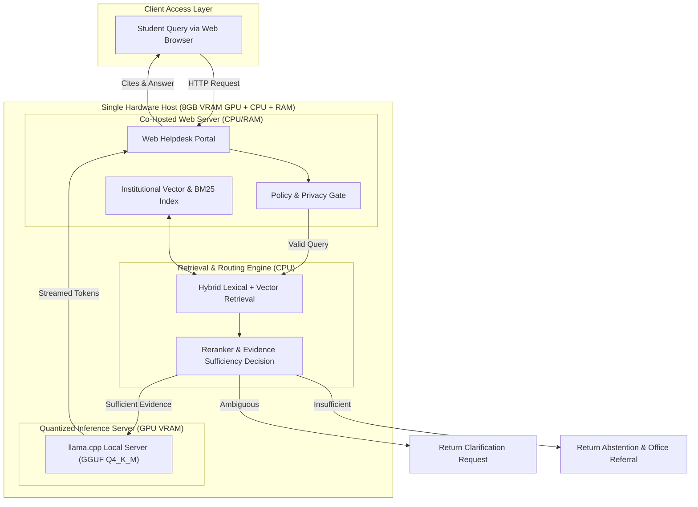

# ISO Standards Integration & Thesis Context Guide

> **Target Degree Program**: Computer Engineering (CpE)  
> **Target Hardware**: Single host machine with an **8 GB VRAM GPU**, co-hosting both the web application (chatbot portal) and the local quantized LLM inference engine (`llama.cpp`).  
> **Core Objective**: Co-optimizing **latency**, **precision**, **accuracy**, and **hardware resource footprint** (VRAM/RAM/CPU) under constrained execution conditions.

---

## 1. Overview & Computer Engineering Context

This document serves as the authoritative guide for integrating international engineering standards into the **Offline University Helpdesk RAG Thesis**.

In Computer Engineering thesis defenses, software and AI systems are evaluated not merely on whether they "work," but on **hardware-software co-design efficiency**, **quantitative resource constraints**, and **empirical measurement rigor**.

---

## 2. Selected ISO Standards & Defense Justification

To ensure a successful thesis defense, three international standards have been selected to structure the theoretical framework, evaluation methodology, and results analysis:

### 1. ISO/IEC 25010:2023 — Product Quality Model
* **What it is**: The standard framework defining software and system product quality characteristics.
* **Why it is there**: It replaces vague quality claims with 4 concrete engineering pillars:
  1. *Performance Efficiency* (Time Behaviour & Resource Utilization)
  2. *Functional Suitability* (Functional Correctness & Accuracy)
  3. *Reliability* (Fault tolerance under memory pressure, groundedness, and abstention)
  4. *Capacity / Limits* (Operating within 8 GB VRAM limits)
* **Why it is important for CpE**: Panels require a standardized software engineering framework to validate that system quality claims are systematically categorized.
* **How to apply**: Used in **Chapter 1** (Theoretical Framework) to establish evaluation pillars and in **Chapter 4** (Results & Discussion) to organize findings.

---

### 2. ISO/IEC 25023:2016 — System & Software Quality Measurement
* **What it is**: The operational measurement standard that accompanies ISO 25010, providing exact mathematical formulas and quantitative metrics.
* **Why it is there**: ISO 25010 tells you *what* to measure; ISO 25023 tells you *how* to calculate it mathematically.
* **Why it is important for CpE**: Essential for Computer Engineering rigor. Prevents generic descriptions by enforcing formal equations for Time to First Token (TTFT), Generation Throughput (TPS), Memory Footprint, and Retrieval Precision.
* **How to apply**: Used in **Chapter 3** (Methodology) to construct the Master Evaluation Matrix and benchmark scripts.

---

### 3. ISO/IEC 42001:2023 — Artificial Intelligence Management System (AIMS)
* **What it is**: The international standard for trustworthy, evidence-grounded AI deployment and model governance.
* **Why it is there**: Governs AI model quantization trade-offs, evidence-aware routing (answering vs clarifying vs abstaining), and institutional data provenance.
* **Why it is important for CpE**: Defends why the system uses local 4-bit GGUF quantization and strict evidence-grounding instead of relying on ungrounded black-box cloud generation.
* **How to apply**: Justifies the evaluation of model variants ($Q_0, Q_1, Q_2$) and refusal/abstention precision in **Chapters 3 & 4**.

---

## 3. Master ISO Evaluation Matrix (Chapter 3 Methodology)

Use this master matrix table when drafting Chapter 3 of the thesis paper:

| ISO Standard | Quality Characteristic | Metric Name | Mathematical Formula / Operational Definition | Measurement Instrument / Tool | Target Benchmark |
| :--- | :--- | :--- | :--- | :--- | :--- |
| **ISO/IEC 25010** | **Performance Efficiency** (Time Behaviour) | Time to First Token (TTFT) | $\text{TTFT} = T_{\text{first\_token\_emitted}} - T_{\text{query\_received}}$ | `llama.cpp` performance logger | $< 1.5 \text{ seconds}$ |
| **ISO/IEC 25010** | **Performance Efficiency** (Time Behaviour) | Generation Throughput | $\text{TPS} = \frac{\text{Total Output Tokens}}{T_{\text{generation\_end}} - T_{\text{first\_token}}}$ | Inference server metrics endpoint | $> 15 \text{ tokens/sec}$ |
| **ISO/IEC 25010** | **Performance Efficiency** (Resource Utilization) | Total Co-Hosted Memory Footprint | $\text{Mem}_{\text{total}} = \text{VRAM}_{\text{model}} + \text{VRAM}_{\text{kv\_cache}} + \text{RAM}_{\text{web\_app}}$ | `nvidia-smi` & `psutil` background logger | $\le 8.0 \text{ GB VRAM}$ (Zero OOM) |
| **ISO/IEC 25023** | **Functional Suitability** (Functional Correctness) | Retrieval Precision@K | $\text{Precision@K} = \frac{\|\text{Relevant Chunks Retrieved}\|}{|K|}$ | Python evaluation benchmark script | $> 85\%$ |
| **ISO/IEC 25023** | **Functional Suitability** (Accuracy) | Answer Groundedness Ratio | $\text{Groundedness} = \frac{\text{Claims Entailed by Evidence}}{\text{Total Claims Generated}}$ | Ragas / TruLens / LLM Judge validation | $> 90\%$ |
| **ISO/IEC 42001** | **AI Reliability & Governance** | Abstention Precision | $\text{Abstention Precision} = \frac{\text{Correct Refusals}}{\text{Unanswerable / Out-of-Domain Queries}}$ | Curated unanswerable test dataset | $100\%$ zero ungrounded hallucination |
| **ISO/IEC 42001** | **Model Optimization Efficiency** | Quantization Loss Delta | $\Delta_{\text{quant}} = \text{Accuracy}_{\text{FP16}} - \text{Accuracy}_{\text{Q4\_K\_M}}$ | Benchmark scripts across Q8, Q5, Q4 variants | $< 5\%$ loss vs FP16 reference |

---

## 4. System Co-Hosting Topology & Hardware Test Protocol

### Co-Hosted Hardware Benchmarking Steps
1. **Idle State Benchmark**: Record baseline VRAM, RAM, and CPU usage when only the web application server is active.
2. **Model-Loaded Benchmark**: Load the GGUF model into VRAM and record remaining VRAM headroom available for KV caching.
3. **Load Testing Benchmark**: Simulate concurrent student queries (1, 5, 10 active requests) to measure TTFT degradation, TPS variance, and memory swap safety under ISO 25010 Capacity limits.

---

## 5. Instructions for Thesis Writing & Future AI Agents

When drafting or editing manuscript sections:

1. **Chapter 1 (Introduction & Framework)**:
   - Add a sub-section titled **"1.X ISO Standards Alignment"** using ISO 25010 and ISO 42001 to justify system design boundaries.
2. **Chapter 3 (Methodology)**:
   - Include Section 3 (**Master ISO Evaluation Matrix**) above with full formulas.
   - Explain how `nvidia-smi` and `psutil` are used to monitor memory co-hosting.
3. **Chapter 4 (Results & Discussion)**:
   - Organize experimental results according to the ISO quality characteristics:
     - *4.1 ISO 25010 Performance Efficiency & Hardware Co-Hosting Analysis*
     - *4.2 ISO 25023 Hybrid Retrieval Precision & Accuracy*
     - *4.3 ISO 42001 AI Reliability & Model Variant Benchmark ($Q_0$ vs $Q_1$ vs $Q_2$)*
