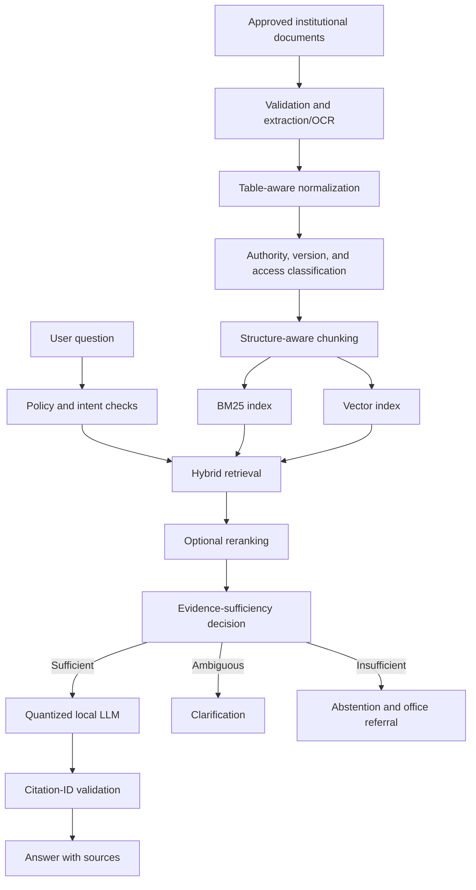

# Offline University Helpdesk Thesis

## Project summary

This thesis investigates whether a small, locally deployed language model can provide grounded university-information assistance under constrained hardware and network conditions. The proposed system combines an approved institutional document corpus, hybrid retrieval, evidence-aware routing, behavior-oriented QLoRA, and quantized inference.

The intended contribution is not merely a chatbot. It is an empirical study of the quality, latency, memory, and reliability trade-offs involved in building an offline retrieval-augmented generation (RAG) system for a university helpdesk.

## Research objective

Design and evaluate an offline-capable university helpdesk that:

- answers questions from approved institutional sources;
- cites the evidence used;
- abstains or asks for clarification when evidence is insufficient;
- protects personal and restricted information;
- supports realistic English, Filipino, and code-switched questions;
- runs on constrained campus hardware;
- remains maintainable as policies and documents change.

## Proposed research questions

1. Does metadata-aware hybrid retrieval with reranking outperform BM25-only and dense-only retrieval on university questions?
2. Does behavior-only QLoRA improve instruction following, citation behavior, and abstention over an untuned instruction model?
3. How does behavior-only QLoRA compare with behavior-plus-facts QLoRA when retrieved evidence conflicts with memorized facts?
4. What quality, latency, concurrency, RAM, and VRAM trade-offs result from deployment quantization?
5. Can the selected configuration meet predefined reliability and response-time targets on the target campus computer?

## Experimental model variants

| ID | Variant | Purpose |
|---|---|---|
| Q0 | Untuned instruction model + identical RAG | Determines whether fine-tuning is necessary |
| Q1 | Behavior-only QLoRA + identical RAG | Tests learned grounding, citation, refusal, and brevity behavior |
| Q2 | Behavior-plus-facts QLoRA + identical RAG | Measures stale-memory and evidence-conflict risk |

Q2 is an ablation, not the presumed production winner. The production candidate should normally keep changeable institutional facts in the retrieval corpus.

## System architecture

A low retrieval score must not be interpreted as chit-chat. Plausible university-information questions proceed through retrieval; weak evidence leads to clarification or abstention.

## Knowledge-base requirements

Store original files and immutable hashes. Each indexed unit should retain at least:

- `document_id` and `document_version`;
- title, page, section, and chunk identifier;
- office owner and approving authority;
- effective and expiry dates;
- status such as draft, approved, superseded, or archived;
- access level and `no_index` status;
- extraction/OCR quality flags;
- source path and content hash.

Tables, schedules, fee matrices, and directories require structure-preserving extraction. Fixed token chunks are a baseline, not a universal rule.

## Routing and answer policy

1. Apply deterministic privacy, access-control, and restricted-request rules.
2. Identify explicit social conversation where rules or a lightweight classifier are reliable.
3. Treat other requests as potential university-information questions and retrieve evidence.
4. Fuse lexical and dense rankings; rerank only when its measured benefit justifies latency.
5. Estimate evidence sufficiency using calibrated validation data rather than a raw RRF threshold.
6. Answer only from supplied evidence, ask one useful clarification, or abstain.
7. Accept only server-issued citation identifiers that correspond to retrieved evidence.

See [prompt_and_routing_architecture.md](prompt_and_routing_architecture.md).

## Fine-tuning strategy

The initial QLoRA configuration should use 4-bit NF4 loading, double quantization, gradient checkpointing, and BF16 compute when the training GPU supports it. Candidate LoRA ranks, target modules, learning rates, and sequence lengths must be tested in a bounded experiment rather than treated as universal optima.

Training examples should use the checkpoint's official chat template and normally compute loss only on assistant output. Split data by source document, intent template, and paraphrase family to limit leakage. Evaluate the adapter before merging, then merge, convert to GGUF, quantize, and evaluate the final deployment artifact again.

Training hardware and deployment hardware are separate concerns. A model file fitting in 8GB VRAM does not prove QLoRA training or concurrent inference will fit.

## Constrained deployment

The target candidate is a quantized 3B instruction model served locally, with GPU memory prioritized for generation. Dense embedding and reranking should be benchmarked on CPU or loaded selectively. Start with a short effective context, top-three evidence chunks, limited history, and conservative decoding.

Compare at least a high-precision reference where available, Q8, Q5_K_M, and Q4_K_M. Record time to first token, prompt and generation throughput, end-to-end latency, RAM, VRAM, answer quality, and queue delay under concurrent requests.

## Evaluation

Evaluate retrieval separately from answer generation. The test collection should include answerable, unanswerable, ambiguous, conflicting, stale-policy, privacy-sensitive, adversarial, multilingual, and code-switched questions.

Report:

- Recall@k, MRR, and nDCG for retrieval;
- evidence-sufficiency precision, recall, F1, and calibration;
- answer correctness and groundedness;
- citation presence, validity, entailment, and completeness;
- correct abstention, useful clarification, wrong refusal, and unsupported answer rates;
- answer coverage and selective risk;
- latency, throughput, RAM, VRAM, and concurrency behavior;
- human ratings and uncertainty intervals.

## Feasible scope

The feasible core is a single-node intranet prototype serving approved institutional information with a 3B quantized model and a controlled corpus. High concurrency, universally strong Filipino generation, very long context, and simultaneous GPU residency for the generator, BGE-M3, and a reranker are stretch goals that require measurement.

A request queue is an acceptable constrained-system design. The thesis should report boundaries honestly rather than claim production capacity from model size alone.

## Documentation map

- [AI project context](docs/consultation/01_ai_project_context.md)
- [Architecture review](docs/consultation/02_architecture_review.md)
- [QLoRA fine-tuning](docs/consultation/03_qlora_fine_tuning.md)
- [Retrieval and knowledge base](docs/consultation/04_retrieval_and_knowledge_base.md)
- [Constrained inference](docs/consultation/05_constrained_inference_optimization.md)
- [Evaluation methodology](docs/consultation/06_evaluation_methodology.md)
- [Feasibility, risks, and scope](docs/consultation/07_feasibility_risks_and_scope.md)
- [Execution roadmap](docs/consultation/08_execution_roadmap.md)

## Primary references

- Dettmers et al., “QLoRA: Efficient Finetuning of Quantized LLMs,” 2023: https://arxiv.org/abs/2305.14314
- Meta, Llama 3.2 3B Instruct model card: https://huggingface.co/meta-llama/Llama-3.2-3B-Instruct
- Hugging Face PEFT documentation: https://huggingface.co/docs/peft/
- Hugging Face TRL documentation: https://huggingface.co/docs/trl/
- Hugging Face bitsandbytes quantization: https://huggingface.co/docs/transformers/quantization/bitsandbytes
- llama.cpp: https://github.com/ggml-org/llama.cpp
- Chen et al., “BGE M3-Embedding,” 2024: https://arxiv.org/abs/2402.03216
- Cormack et al., “Reciprocal Rank Fusion,” 2009: https://doi.org/10.1145/1571941.1572114

## Status

This document defines the revised thesis plan. Numerical thresholds, context sizes, model placement, and production capacity remain experimental decisions until validated on the actual corpus and target hardware.
