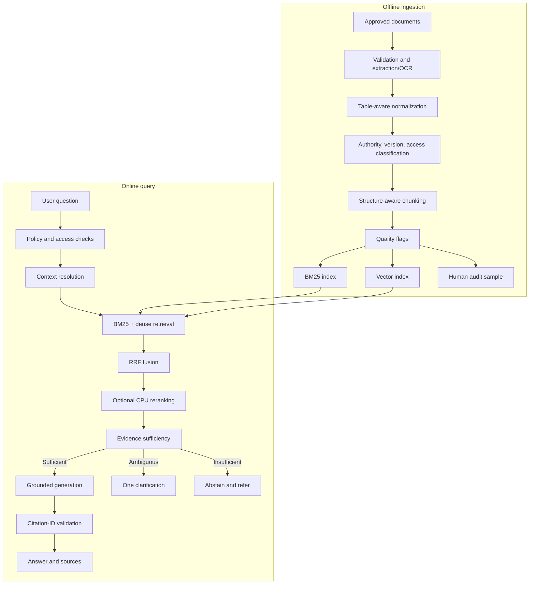

# 02. Architecture Review

## Summary

The overall design is conceptually sound. The strongest idea is separating changeable institutional facts, which belong in retrieval, from stable behavior, which is a good QLoRA target. The main revisions concern routing, evidence confidence, citation validation, table handling, document authority, and stack simplicity.

## What is sound

- Preserving original documents and content hashes.
- Version and freshness tracking.
- Structure-aware chunking with page and section metadata.
- Combining BM25 and dense retrieval with rank fusion.
- Optional reranking.
- Evaluating retrieval independently from generation.
- Local, privacy-preserving deployment.
- Retaining excluded content as `no_index` rather than deleting it.

## What needs revision

### 1. Routing must not collapse to chit-chat on low scores

Weak retrieval has many causes beyond casual conversation. Plausible university questions must proceed to retrieval and then to a sufficiency decision. See `prompt_and_routing_architecture.md`.

### 2. Evidence confidence must be calibrated

Raw RRF scores are fusion scores, not answerability probabilities. Use a small interpretable classifier over retrieval features. See `04_retrieval_and_knowledge_base.md`.

### 3. Citation checking must go beyond string matching

Distinguish presence, validity, entailment, and completeness. Assign citation IDs server-side.

### 4. Tables must survive extraction

Fee matrices, schedules, and directories lose meaning when flattened to prose. Preserve table structure with page metadata.

### 5. Document authority must be explicit

Newest upload time is not authority. Track approval, effective dates, and status so conflicts resolve correctly.

### 6. The software stack should be simplified

The online flow is essentially route, retrieve, rerank, generate, validate. A direct Python pipeline is more transparent and reproducible than heavy orchestration frameworks unless stateful branching, retries, or resumable tools are genuinely required.

## Recommended architecture

## Component boundaries

| Component | Responsibility | Placement |
|---|---|---|
| Ingestion | Validate, extract, normalize, classify, chunk, index | Offline, admin-only |
| Retrieval | Lexical, dense, fusion, optional rerank | CPU preferred |
| Routing | Policy, intent, sufficiency, call budget | CPU |
| Generation | Single grounded answer | GPU |
| Validation | Citation IDs, output contract | CPU |
| Evaluation | Retrieval and end-to-end metrics | Offline |

## Data-flow rules

- Access filters run before evidence reaches the generator.
- Documents are untrusted data; embedded instructions never override policy.
- The generator sees only server-issued evidence with citation IDs.
- Conversation memory is bounded and never treated as authoritative evidence.
- Every decision logs document IDs and outcome, minimizing personal content.

## Authority and freshness handling

1. Exclude drafts, superseded, expired, and unauthorized sources at retrieval time.
2. Prefer approved authority and applicable effective dates.
3. On genuine conflict, state the conflict and refer to the responsible office.

## Stack recommendation

- Prefer a single vector index plus a metadata store over adopting two overlapping databases as interchangeable.
- Choose one production quantization runtime; treat a second runtime as an experiment only if runtime comparison is a research goal.
- Add orchestration frameworks only when their stateful features are actually needed.

## Open architectural questions

- Parent-child retrieval versus flat chunks for procedures and tables.
- Whether reranking earns its latency on the institutional test set.
- Whether embeddings and reranking can share CPU budget without harming latency.

## References

- Lewis et al., “Retrieval-Augmented Generation,” 2020: https://arxiv.org/abs/2005.11401
- Cormack et al., “Reciprocal Rank Fusion,” 2009: https://doi.org/10.1145/1571941.1572114
- Hugging Face Transformers documentation: https://huggingface.co/docs/transformers/
