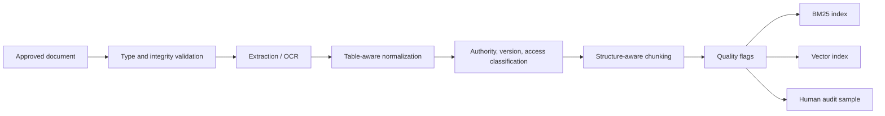

# 04. Retrieval and Knowledge Base

## Goal

Build a retrieval layer that finds correct institutional evidence under a latency budget, preserves structured content, tracks authority, and supports an evaluated evidence-sufficiency decision.

## Ingestion pipeline



Store original files with immutable content hashes so any indexed unit can be traced back to its source and version.

## Table handling

Plain text extraction commonly destroys row and column relationships, merged headers, footnotes, and date associations. For schedules, fees, and directories this is likely the largest source of retrieval failure.

Recommendations:

- detect tables during extraction;
- preserve them as Markdown tables, HTML-like records, or normalized key-value rows;
- keep header context attached to each row;
- retain page and section metadata.

## Chunking strategies to compare

Treat fixed 250-450 token chunks as a baseline only. Compare on a representative subset:

| Strategy | Best for |
|---|---|
| Fixed-size | Uniform prose baseline |
| Heading-aware | Policies and handbooks |
| Parent-child | Procedures needing local plus broader context |
| Document-type-specific | Tables, calendars, directories, FAQs |

## Metadata schema

```json
{
  "document_id": "REG-ENROLL-2026",
  "document_version": "2026.1",
  "title": "Enrollment Handbook 2026",
  "page": 14,
  "section": "Late Enrollment",
  "chunk_id": "REG-ENROLL-2026:P14:C3",
  "office_owner": "Registrar",
  "approved_by": "Academic Council",
  "effective_from": "2026-06-01",
  "effective_until": null,
  "status": "approved",
  "supersedes": "REG-ENROLL-2025",
  "access_level": "public",
  "no_index": false,
  "extraction_quality": "high",
  "source_hash": "sha256:..."
}
```

## Retrieval configurations to compare

1. BM25 only.
2. Dense only.
3. BM25 + dense with RRF.
4. Hybrid + reranker.
5. Cleaned versus minimally cleaned corpus.

Reciprocal rank fusion:

$$
\operatorname{RRF}(d)=\sum_{r \in R}\frac{1}{k+\operatorname{rank}_{r}(d)}
$$

RRF combines rankings without comparing unlike lexical and dense scores. Its output is a fusion score, not a probability of answerability.

## Embedding and reranking model trade-offs

BGE-M3 is capable and multilingual, but it is roughly a 568M-parameter model; running it alongside a cross-encoder reranker on CPU may add noticeable latency on older campus hardware.

Benchmark at minimum:

- a small English embedding model;
- a multilingual candidate such as BGE-M3;
- reranker enabled versus disabled.

Do not choose an English-only model if Filipino and code-switching are essential, and do not adopt BGE-M3 purely on public benchmarks. Build an institution-specific retrieval test set.

## Evidence-sufficiency calibration

Estimate sufficiency with a small interpretable model over features such as top reranker score, gap to the second candidate, count above a relevance criterion, lexical and entity overlap, source authority and validity, source agreement, and query language.

$$
P(\text{sufficient}\mid x)=\sigma(\beta_0+\beta_1 s_{\text{rerank}}+\beta_2 \Delta s+\beta_3 s_{\text{bm25}}+\beta_4 s_{\text{dense}})
$$

Select thresholds on held-out data and report precision, recall, F1, calibration error, coverage, and selective risk. Weight false positives heavily because they produce confident unsupported answers.

## Retrieval evaluation

For each test question, annotate relevant document IDs, relevant pages or sections, acceptable supporting chunks, language, category, difficulty, and whether an answer exists.

Report:

- Recall@k;
- MRR;
- nDCG;
- retrieval latency at target settings;
- language-stratified performance.

## Common pitfalls

- Flattening tables into meaningless prose.
- One global threshold across query types and languages.
- Selecting embeddings by public benchmark rather than institutional data.
- Treating newest upload as authoritative.
- Ignoring reranker latency on the target machine.

## References

- Chen et al., “BGE M3-Embedding,” 2024: https://arxiv.org/abs/2402.03216
- BGE-M3 model card: https://huggingface.co/BAAI/bge-m3
- BGE reranker model card: https://huggingface.co/BAAI/bge-reranker-v2-m3
- Cormack et al., “Reciprocal Rank Fusion,” 2009: https://doi.org/10.1145/1571941.1572114
- Robertson and Zaragoza, “The Probabilistic Relevance Framework: BM25 and Beyond,” 2009: https://doi.org/10.1561/1500000019
- Sentence Transformers documentation: https://www.sbert.net/
