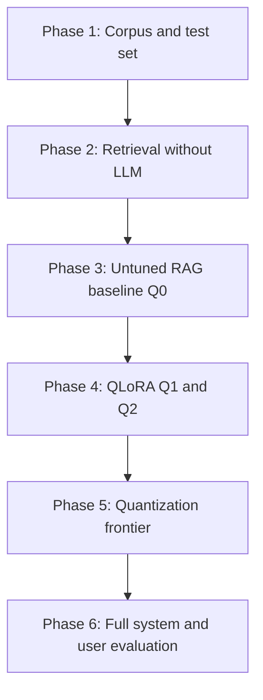

# 08. Execution Roadmap

## Purpose

Provide an ordered, dependency-aware plan with decision gates and artifacts. No time estimates; progress is driven by completed gates.

## Phase overview

## Phase 1: Corpus and test set

- Select approved document categories.
- Define authority and freshness rules.
- Build a representative question set across languages and categories.
- Annotate relevant pages and answerability.
- Measure inter-annotator agreement on a subset.

Gate: labeled retrieval and answer sets exist with acceptable agreement.

## Phase 2: Retrieval without an LLM

- Compare BM25, dense, hybrid + RRF, hybrid + reranker.
- Compare chunking strategies on a representative subset.
- Benchmark embedding and reranking latency on target hardware.

Gate: a retrieval configuration meets Recall@k and latency targets.

## Phase 3: Untuned RAG baseline (Q0)

- Use the untuned instruction model with the chosen retrieval.
- Compare prompt variants P0/P1/P2/P3.
- Compare top-1/top-3/top-5 evidence.

Gate: baseline groundedness, citation, abstention, and latency recorded.

## Phase 4: QLoRA (Q1 and Q2)

- Build behavior dataset with leakage-safe splits.
- Train Q1 behavior-only; train Q2 behavior-plus-facts.
- Evaluate adapters pre-merge on identical replayed evidence.
- Run the stale-fact experiment for Q2.

Gate: Q0 versus Q1 versus Q2 comparison on identical evidence.

## Phase 5: Quantization frontier

- Merge, convert to GGUF, quantize.
- Compare reference, Q8, Q5_K_M, Q4_K_M, optional Q3.
- Re-evaluate the final quantized artifact.

Gate: a quantization level meets quality, latency, and memory targets.

## Phase 6: Full system and user evaluation

- Test on realistic hardware.
- Test 1, 2, and 4 concurrent users; add queueing if needed.
- Test multilingual queries, source updates, missing documents, privacy requests, adversarial inputs.
- Run human evaluation with agreement reporting.

Gate: end-to-end metrics meet predefined reliability and latency targets.

## Minimum viable thesis

- One approved corpus with a labeled test set.
- One evaluated retrieval configuration.
- Q0 versus Q1 comparison on identical evidence.
- One quantized deployment benchmarked on target hardware.
- Retrieval and end-to-end metrics with coverage and selective risk.
- Honest feasibility and limitation reporting.

## Optional extensions

- Q2 stale-fact ablation.
- Parent-child retrieval.
- Automated citation-entailment scoring validated against humans.
- Concurrency scaling study.
- Multilingual meaning-preservation study.

## Artifacts to preserve

- corpus manifest with versions and hashes;
- labeled retrieval and answer sets;
- retrieval configuration and results;
- training data, splits, seeds, and pinned versions;
- adapter, merged, and quantized model hashes;
- benchmark matrix;
- evaluation reports with confidence intervals;
- annotation guidelines.

## Completion criteria

- Each research question answered with evidence.
- Claims supported by measurement, not assumption.
- Limitations and infeasible items stated explicitly.
- Reproducible pipeline from corpus to evaluation.

## Cross-references

- Architecture: `02_architecture_review.md`
- QLoRA: `03_qlora_fine_tuning.md`
- Retrieval: `04_retrieval_and_knowledge_base.md`
- Inference: `05_constrained_inference_optimization.md`
- Evaluation: `06_evaluation_methodology.md`
- Feasibility: `07_feasibility_risks_and_scope.md`
