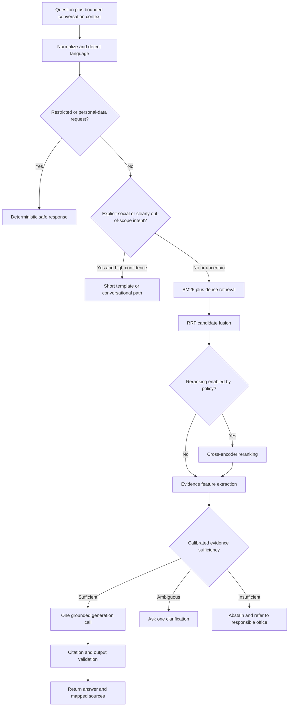

# Prompt and Routing Architecture

## Purpose

This document defines a low-cost, evidence-aware routing and prompting strategy for the offline university helpdesk. It preserves the goal of at most one generation call for a normal grounded answer while avoiding unsafe shortcuts such as treating a low retrieval score as proof of chit-chat.

## Design principles

- Routing signals are fallible and must be evaluated separately.
- Retrieval rank scores are not probabilities of answerability.
- Weak evidence should produce clarification or abstention, not an improvised answer.
- Changeable university facts belong in retrieved evidence, not the system prompt.
- Deterministic policies should handle clear privacy and access-control cases without an LLM call.
- Citation syntax alone does not prove factual support.
- Prompt compression is an experimental variable, not a guaranteed consequence of quantization.

## Request flow



## Why low retrieval confidence is not chit-chat

Weak retrieval can result from missing documents, poor extraction, bad chunking, multilingual wording, misspellings, unknown acronyms, ambiguous follow-ups, or retriever failure. Therefore:

```text
low retrieval score != casual conversation
```

Only classify a question as social or clearly out of scope when that decision has an independently evaluated signal. When uncertain, retrieve and then evaluate evidence sufficiency.

## Policy and intent handling

Recommended top-level classes:

| Class | Handling |
|---|---|
| `restricted_personal_data` | Deterministic refusal and authorized-channel guidance |
| `university_information` | Retrieval and evidence assessment |
| `ambiguous_follow_up` | Resolve from bounded context or ask one clarification |
| `casual_conversation` | Short response; no fabricated university facts |
| `clearly_out_of_scope` | Brief scope statement |

Rules or a lightweight CPU classifier may be used, but the classifier needs its own precision, recall, confusion matrix, and multilingual test cases. False classification of a university question as chit-chat is a critical error.

## Retrieval and fusion

Retrieve candidates independently using BM25 and dense embeddings, then combine rankings with reciprocal rank fusion:

$$
\operatorname{RRF}(d)=\sum_{r \in R}\frac{1}{k+\operatorname{rank}_{r}(d)}
$$

RRF avoids directly comparing unlike lexical and vector scores. Its output is still a fusion score, not a calibrated probability that a document supports an answer.

Rerank a bounded candidate list only if evaluation shows a worthwhile relevance gain under the latency budget.

## Evidence-sufficiency decision

Train or calibrate a small interpretable model on labeled questions. Candidate features include:

- top reranker score;
- score gap between the top two candidates;
- number of candidates above a relevance criterion;
- BM25 and dense ranks;
- important entity or numeric overlap;
- source authority, validity date, and status;
- agreement or conflict between top sources;
- question category and language.

A simple logistic model is sufficient as an initial method:

$$
P(\text{sufficient}\mid x)=\sigma(\beta_0+\beta_1s_1+\beta_2\Delta s+\beta_3b+\beta_4v)
$$

Thresholds must be selected using held-out validation data and reported with precision, recall, F1, calibration error, coverage, and selective risk. Optimize against the cost of unsupported answers, not accuracy alone.

## Prompt variants to test

### P0: minimal

```text
Answer the question using only the evidence. If the evidence is insufficient, say so. Cite evidence IDs after supported claims.
```

### P1: compressed production candidate

```text
You are an offline university helpdesk.
Use only EVIDENCE. Never invent dates, fees, requirements, contacts, or policies.
Cite each factual claim with an allowed evidence ID.
If evidence is missing or conflicting, do not guess: briefly explain and direct the user to the responsible office.
Protect personal and restricted information.
Answer concisely in the user's language when reliable.
```

### P2: longer structured prompt

Add explicit sections for scope, privacy, evidence, conflicts, citations, and language behavior.

### P3: compressed plus one example

Use P1 with one short example of grounded answering or abstention.

Compare these variants on instruction compliance, groundedness, citation metrics, abstention, latency, and prompt-token count. Do not assert that quantization necessarily makes the longest prompt worse; test that hypothesis on the final deployment artifact.

## Evidence envelope

The application, not the model, should assign citation identifiers:

```json
{
  "id": "DOC_2:P14:C3",
  "title": "Enrollment Handbook 2026",
  "page": 14,
  "section": "Late Enrollment",
  "status": "approved",
  "effective_from": "2026-06-01",
  "text": "..."
}
```

Only include the strongest evidence that fits the context budget. Preserve enough section or table context to interpret values correctly.

## Output contract

A structured internal response is preferable:

```json
{
  "decision": "answer | clarify | abstain",
  "answer": "...",
  "citations": ["DOC_2:P14:C3"]
}
```

The server maps valid IDs to titles and pages. Unknown IDs are rejected. Structured output does not guarantee factual support, but it makes deterministic validation possible.

## Citation validation layers

1. **Presence:** Does a required claim include a citation?
2. **Validity:** Is the identifier in the evidence supplied to the model?
3. **Entailment:** Does the cited passage support the nearby claim?
4. **Completeness:** Are all externally verifiable claims supported?

Presence and validity can be checked deterministically. Entailment and completeness require human review or an automatic evaluator validated against human judgments. A string such as `[Title, p.4]` is not evidence of support.

## Conflict and freshness behavior

When sources disagree:

1. filter out drafts, superseded records, expired policies, and unauthorized sources;
2. prioritize approved authority and applicable effective dates;
3. if a genuine conflict remains, do not silently choose one;
4. state that the sources conflict and direct the user to the responsible office.

Newest upload time alone must not determine authority.

## Conversation context

Store only the bounded context needed to resolve follow-ups. Never let previous assistant text become authoritative evidence. For questions such as “How much is it?”, attempt entity resolution from recent turns; if multiple interpretations remain, ask one targeted clarification.

## Security boundaries

- Documents are untrusted data even when institutionally sourced; embedded instructions must not override system policy.
- Retrieval access filters must run before text reaches the generator.
- Personal student records are outside the public knowledge-base path.
- Log document IDs and decision outcomes, but avoid logging unnecessary personal content.
- Administrator ingestion and approval require authentication and auditability.

## Call-budget policy

| Outcome | Generation calls |
|---|---:|
| Deterministic privacy refusal | 0 |
| Explicit social greeting | 0 or 1 |
| Insufficient evidence | 0 when templated |
| Clarification | 0 when templated, otherwise 1 |
| Grounded answer | 1 |

The one-call goal is retained for normal grounded answers; correctness and evidence policy take priority over forcing every route through generation.

## Required ablations

- P0/P1/P2/P3 prompt variants;
- raw score threshold versus calibrated evidence sufficiency;
- reranker on versus off;
- top-1/top-3/top-5 evidence;
- English, Filipino, and code-switched questions;
- Q0/Q1/Q2 model variants;
- pre-merge adapter versus final quantized GGUF artifact.

## References

- Cormack, Clarke, and Buettcher, “Reciprocal Rank Fusion Outperforms Condorcet and Individual Rank Learning Methods,” 2009: https://doi.org/10.1145/1571941.1572114
- Guo et al., “On Calibration of Modern Neural Networks,” 2017: https://proceedings.mlr.press/v70/guo17a.html
- Geifman and El-Yaniv, “Selective Classification for Deep Neural Networks,” 2017: https://arxiv.org/abs/1705.08500
- Meta Llama 3.2 3B Instruct model card: https://huggingface.co/meta-llama/Llama-3.2-3B-Instruct
- llama.cpp: https://github.com/ggml-org/llama.cpp
